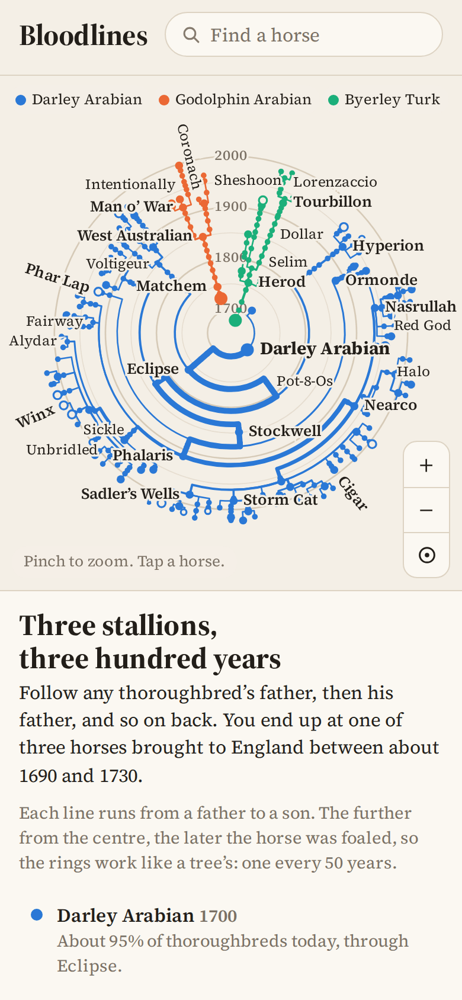
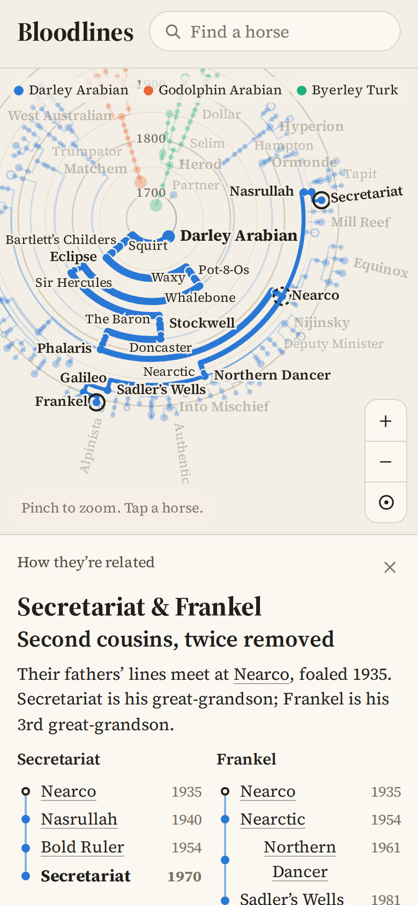
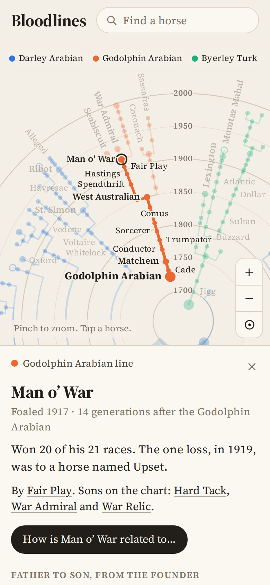

# Bloodlines

**Use it: [junkdrawer.works/bloodlines](https://junkdrawer.works/bloodlines/)**

**A round family tree of the thoroughbred racehorse, from three stallions brought to England around 1700 to the horses racing today.** Every line runs from a father to a son, and the distance from the centre is the year the horse was foaled. Tap any horse to light up its line back to its founder, or pick two to see how they're related: Secretariat and Frankel, it turns out, are second cousins, twice removed.

<p align="center">
  
  &nbsp;
  
  &nbsp;
  
</p>

## How it works

- **Three colours, three founders.** Blue is the Darley Arabian, orange the Godolphin Arabian, green the Byerley Turk. About 95% of thoroughbreds alive today are on the blue side.
- **Rings are years.** One every 50 years, like a tree's, from 1700 in the middle to the 2000s at the rim.
- **Tap a horse** for what it's known for, its father and sons on the chart, and the whole line back to its founder, one generation at a time.
- **"How is it related to…"** picks a second horse and finds where their fathers' lines meet: "War Admiral is Seabiscuit's uncle", "Winx and Zenyatta have the same father", "Man o' War and Secretariat aren't related through their fathers at all".
- **Find a horse** by typing part of its name. Accents, dots and "the" don't matter.
- **Show** the American Triple Crown winners or the great mares, all lit up at once.
- **Links you can share.** The address follows along: `#Secretariat`, `#Secretariat/Frankel`, `#show=us3`.
- It follows only the sire line, the way breeders group horses. Through their mothers, thoroughbreds carry all three founders many times over.
- No account and no server. It works offline and installs to a phone's home screen.

## The horses

There are 340 of them: the famous ones and every stallion needed to join them up, in `js/horses.js`, one per line (`name | year foaled | sire | tags | note`). Each sire link, foaling year and note was checked against Wikipedia's article on the horse. The 95% figure comes from a 2005 study of the stud books by Patrick Cunningham's group at Trinity College Dublin, reported in [New Scientist](https://www.newscientist.com/article/dn7946-95-of-thoroughbreds-linked-to-one-superstud/).

To add a horse, add a line under its sire. `npm test` checks that every horse traces back to a founder and was foaled after its father.

## Running it

It's a static site: plain HTML, CSS and JavaScript, with no build step.

```sh
npx serve .                   # or any static file server, then open the printed address
npm test                      # checks the family tree, then uses the app in Chromium (needs Playwright)
npm install                   # once, for the screenshot tool's PNG compressor
node tools/screenshots.mjs    # redraws docs/*.png and og.png
node tools/make-icons.mjs     # redraws the PNG icons from icon.svg
```

To put it online with GitHub Pages: **Settings → Pages → Build and deployment → Deploy from a branch**, then pick `main` and `/ (root)`.

### Files

- `js/horses.js`: the horses, and who sired whom.
- `js/tree.js`: builds the tree, lays it out in a circle, and works out how two horses are related. No drawing, so it's tested in plain Node.
- `js/app.js`: draws the chart on a canvas, handles dragging, pinching and tapping, the search box and the side panel.
- `css/app.css`: layout and the light and dark palettes.
- `fonts/`: Source Serif 4 (SIL Open Font License), served from here so nothing loads from elsewhere.
- `sw.js`: keeps a copy for using offline.
- `test/tree.test.mjs`, `test/e2e.mjs`: the tests.
